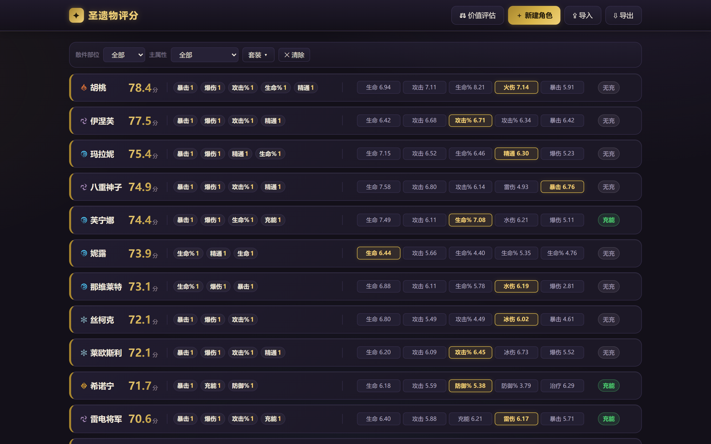
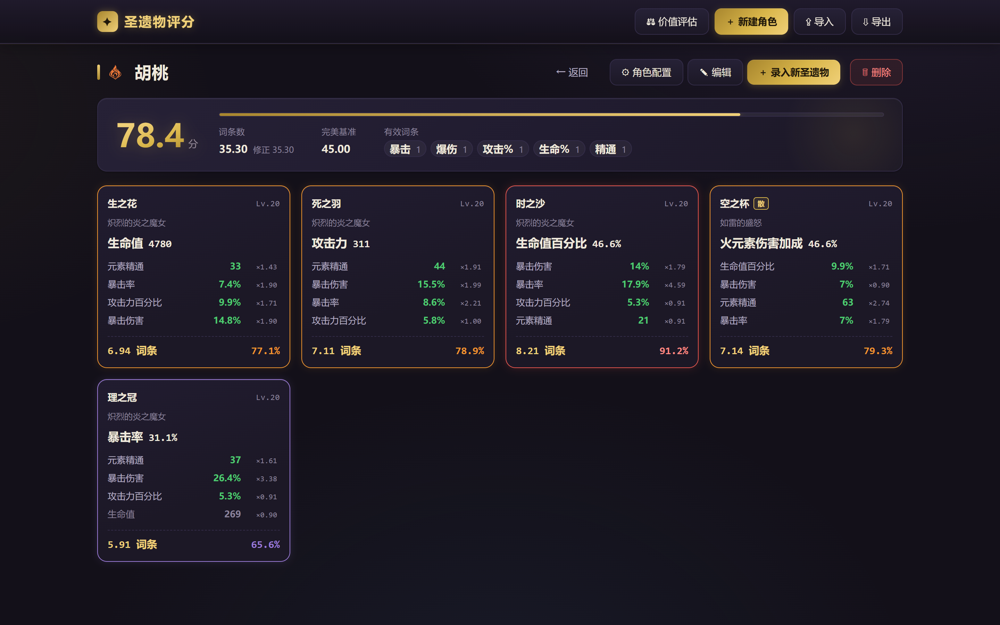

# 圣遗物评分工具

<div align="center">


</div>

原神圣遗物配置管理网页：保存并管理各角色的圣遗物配置，量化评估圣遗物词条价值，为「强化还是替换」提供决策参考。

纯前端实现（原生 HTML/CSS/JS，无框架、无构建步骤），数据保存在浏览器 localStorage，支持导出 / 导入 / 合并 JSON 备份。

## 功能特性

**三大核心算法**

- **单件词条计算**：基于滚数当量（显示值 ÷ 词条上限 × 词条权值，仅统计有效词条）量化单件圣遗物
- **角色评分**：以「客观完美态」为满分基准（随角色的有效词条与权值动态计算，非固定目标值），支持散件与套装件双模式；元素充能效率作为达标型属性处理（超额惩罚、不足提示）
- **圣遗物价值评估**：区分「作为散件」与「作为同部位同套装同主词条的套装件」两种情形，结合当前评分与强化潜力给出强化 / 替换建议

**其他能力**

- **66 位预配置角色**：内置角色定位相关的有效词条、建议权值与充能达标值（数据随游戏 5.x 版本整理）
- **文本快速录入**：粘贴游戏内圣遗物文本自动解析主词条 / 副词条，支持自定义套装名识别（自定义套装置顶显示并参与筛选）
- **潜力评估**：`potential = 当前评分 + 待激活贡献 + 剩余可强化空间 × 最大词条权值`——未满级判强化价值、满级判替换价值
- **3/4 词条初始圣遗物**：通过「待激活」状态支持未激活词条的录入
- **数据管理**：localStorage 持久化，带版本化 migrate 数据迁移，防丢字段；JSON 导出 / 导入 / 合并（并集）
- **首页筛选**：按散件部位 / 主属性 / 套装多选过滤，筛选状态可持久化、刷新自动恢复

## 界面预览

<p align="center">
  
  <br>
  <sub>左：首页角色列表（评分排序 / 有效词条 / 充能达标状态）　　右：角色详情（总分达成度 / 逐件圣遗物滚数当量与达成百分比）</sub>
</p>

## 快速开始

无需安装依赖、无需构建：直接用浏览器打开 `index.html` 即可使用。

## 运行测试

```bash
# 算法层与文本识别回归测试（142 条用例，Node 环境）
node test.js

# DOM 集成冒烟测试（需 jsdom：npm i jsdom）
node test-dom.js
```

## 项目结构

```
index.html                 入口页面
css/style.css              全部样式（设计 token 集中在文件顶部 :root）
js/
  constants.js             常量（词条上限、套装列表与别名、元素表等）
  data.js                  66 位角色预配置数据（有效词条 / 权值 / 充能）
  parser.js                圣遗物文本解析（含自定义套装识别）
  core.js                  三大核心算法实现
  adapters.js              数据适配层
  store.js                 状态管理
  storage.js               localStorage 持久化与 migrate
  io.js                    导出 / 导入 / 合并
  ui.js                    界面渲染与交互
  feedback.js              弹窗 / 通知等反馈组件
  main.js                  入口
assets/elements/           元素图标
test.js                    算法回归测试
test-dom.js                jsdom 页面冒烟测试
docs/                      设计与开发文档（背景知识 / 算法设计 / 实现方案 / UI 优化说明）
backups/                   网页导出的数据 JSON 备份（随仓库版本化保存）
```

## 设计文档

| 文档 | 内容 |
| --- | --- |
| [docs/圣遗物背景知识总结.md](docs/圣遗物背景知识总结.md) | 圣遗物系统背景知识（词条类型、数值上下限等） |
| [docs/圣遗物评分算法设计.md](docs/圣遗物评分算法设计.md) | 三大算法的完整设计：公式、伪代码与定稿示例数据 |
| [docs/圣遗物网页实现方案.md](docs/圣遗物网页实现方案.md) | 网页实现方案：架构、模块划分与数据模型 |
| [docs/UI优化说明.md](docs/UI优化说明.md) | UI 体系优化说明：设计 token、组件 class 体系与变更记录 |

## 免责声明

本项目为粉丝制作的个人工具，与 miHoYo / HoYoverse 无官方关联。项目中涉及的名称与图标素材版权归 miHoYo / HoYoverse 所有，仅作非商业用途展示。
